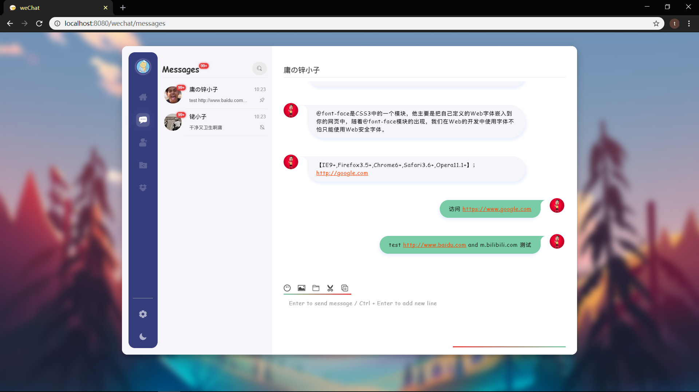

# ChatApp
在线聊天系统

## 工具版本
| 工具          | 版本                                      |
| ------------- | ---------------------------------------- |
| node.js (nvm) | 16.13.1 / 10.5.0 (node-sass 等使用低版本) |
| yarn          | 1.22.17                                  |
| @vue/cli      | 4.5.15 (requires @vue/cli-init)          |
| mysql8        |                                          |
| redis-3.2     |                                          |

## 功能
- [x] 登陆注册
- [ ] 单聊
- [ ] 群聊
- [ ] 历史消息
- [ ] 图片发送
- [ ] 文件发送
- [ ] 代码片段发送
- [ ] 表情发送
- [ ] 白板协作
- [ ] 音视频聊天
- [ ] 消息已读提醒
- [ ] 好友分组
- [ ] 好友备注
- [ ] 好友上线提醒
- [ ] 在线用户头像高亮
- [ ] 添加好友
- [ ] 添加群聊
- [ ] 朋友圈功能
- [ ] 发表朋友圈
- [ ] 好友朋友圈
- [ ] 朋友圈动态点赞
- [ ] 朋友圈动态评论
- [ ] 朋友圈动态回复评论
- [ ] 日程设置

## 启动项目
* `net start mysql`
* `redis-server`
* `yarn start`
> node 版本：10.5.0

## 项目运行截图
`SignIn/SignUp`

`message collection`

